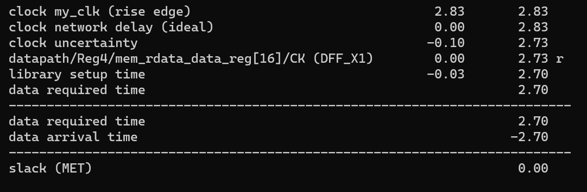

<!-- TABLE OF CONTENTS -->
## Table of Contents

* [About the Project](#about-the-project)
  * [Built With](#built-with)
* [Getting Started](#getting-started)
  * [Prerequisites](#prerequisites)
  * [Build](#installation)
  * [Generate Analysis Files](#generate-analysis-files)
* [Details](#details)
  * [icache/dcache](#icachedcache)
  * [Arbiter](#arbiter)
  * [5 Stage Pipeline](#5-stage-pipeline)
  * [L2 Cache](#l2-cache)
  * [Branch Prediction](#branch-prediction)
  * [M-Extension](#m-extension)
  * [Performance Metrics](#performance-metrics)
  * [Detailed Datapath](#detailed-datapath)
* [Performance Analysis and Design Evolution](#performance-analysis-and-design-evolution)
* [Improvement Possibilities](#improvement-possibilities)
* [Acknowledgements](#acknowledgements)


<!-- ABOUT THE PROJECT -->
## About The Project


This is an impementation of a five stage pipelined risc-v 32i+m-extension processor with hazard detection, forwarding and branch prediction. The Memory hierarchy includes a direct mapped i-cache, direct mapped d-cache, an arbiter that coordinates memory accesses and a 4-way set associative L2 cache.


### Built With
SystemVerilog was used for design and testbench files. Synopsys's VCS and Synopsys's Design Compiler were used to compile all the files and generate timing, area and power analysis files. Synopsys's Verdi was used to analyze the waveform.
* [SystemVerilog](https://en.wikipedia.org/wiki/SystemVerilog#:~:text=SystemVerilog%2C%20standardized%20as%20IEEE%201800,of%20the%20same%20IEEE%20standard.)
* [Synopsys VCS](https://www.synopsys.com/verification/simulation/vcs.html)
* [Synopsys Verdi](https://www.synopsys.com/verification/debug/verdi.html)
* [Synopsys Design Compiler](https://www.synopsys.com/implementation-and-signoff/rtl-synthesis-test/dc-ultra.html)


<!-- GETTING STARTED -->
## Getting Started


### Prerequisites

You need:

1. Synopsys VCS
2. Synopsys Verdi
3. Synopsys Design Compiler 

### Installation

Contact Synopsys

### Build

You can build any of the .elf or .s files in the /design/testcode/ directory. Large assembly files exist under the /design/testcode/comp/ folder for greater coverage and coremark files exist under /design/testcode/coremark. comp/comp2_rv32im.elf and coremark/coremark_rv32im.elf include the m-extension, note the 'm' before the '.elf'. None of the other files have an m-extension supported version. You must be in the 'Design' folder to compile any files.

Example:
```
make run ASM=testcode/coremark/coremark_rv32im.elf
```

When the simulation has completed, you will see:


### Generate Analysis Files

To view timing and area analysis, you need to synthesize the design. They will be placed in the synth/reports folder.

```
make synth
```

the timing report looks like this:


It shows you the critical path (it's cut off here), the time allowed for the critical path to resolve, and the time it actually took for the critical path to resolve (the difference between what we allow and what happened is the slack).

The area report looks like this:


It shows you the area breakdown in terms of combinational, non-combinational, total and a further breakdown by module (it's cut off here).

To generate the power analysis, you must specify which program you are analyzing the power for:

```
make report_power ASM=testcode/comp/comp2_rv32i.elf
```

The power report will show:


The top and bottom are cutoff to save space. Our design's power is overwhelmingly consumed by the caches, specifically the 4-way shared L2 cache.


# Details:

### icache/dcache

The icache and dcache are both direct mapped with 32 byte cachelines with 16 lines, giving a total size of 512 bytes. The caches are separate which allow simultaneous access by the cpu. The icache is used by the instruction fetch stage and the dcache is used by the memory stage. Both caches are connected to the arbiter which facilitates physical memory accesses and resolves simultaneous memory requests.

### Arbiter

The arbiter connects the icache or dcache to the L2 cache whenever there is a memory request from the cpu. If both the icache and dcache request access to memory at the same time, the arbiter will prioritize the dcache. The choice to prioritize the dcache is arbitrary. Here is the state machine for the arbiter:


### 5 Stage Pipeline

Our pipeline includes an instruction fetch stage [IF], an instruction decode stage [ID], an execute stage [EX], a memory stage [MEM] and a write back stage [WB]. There are four pipeline registers, one between each stage, which store all values passed to the next stage. We also have a hazard detection unit that stalls the pipeline on cache misses or when the multiplier is executing and adds bubbles to the pipeline when there is a read-after-write-from-memory dependency or a branch misprediction. We have a forwarding unit as well to send correct values to the EX stage when instructions have read-after-write-to-register dependencies.

[add picture of pipeline datapath with hazard detection and forwarding]

### L2 Cache

The L2 cache is 4-way set associative using the pLRU replacement policy. Each line is 32 bytes and there are 16 sets, making it 2 KB large. It is a shared cache, storing cachlines for the icache and dcache. the L2 cache connects to the 'cacheline adapter' which itself connects to the main memory. The cacheline adapter accepts 4 bursts of 8 bytes of data, combines them, and sends the resulting 32 bytes of data to the L2 cache. 

[picture of L2 cache]

### Branch Prediction

The branch predictor implemented in this design uses a local branch history table (LBHT), a direction prediction table (DPT) and a branch target buffer (BTB). The LBHT is indexed by bits [6:2] of the PC, which gives us 32 entries in the LBHT. Each entry stores 5 bits of branch history and itself is used to index into the direction prediction table (DPT). This also gives us 32 entries in the DPT. Each entry of the DPT stores a 2-bit saturation counter where 00 = strongly not taken, 01 = weakly not taken, 10 = weakly taken, 11 = strongly taken. The BTB stores the target branch address for each branch instruction the cpu comes accross. Bits [7:2] are used to index into the BTB, giving the BTB 64 entries. When the DPT predicts 'taken' and there is a BTB hit, then we take the target prediction form the BTB as the next instruction address.


### M-Extension


### Performance Metrics


### Detailed Datapath:


[show block diagram here]


# Performance Analysis and Design Evolution


# Improvement Possibilities


<!-- ACKNOWLEDGEMENTS -->
# Acknowledgements
* [Readme Template](https://github.com/othneildrew/Best-README-Template)


